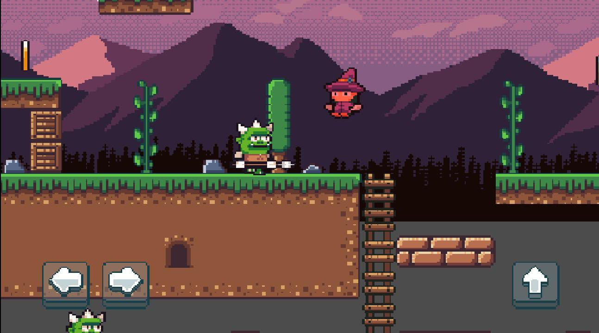

# Jogo de Plataforma 2D - Godot Engine
## Joguinho de plataforma 2D feito com Godot Engine e GDScript para experimentar a engine. 

### Desenvolvi esse joguinho para aprender a usar a Godot, aprendi bastante coisa e gostei muito da engine. Destaque para o editor visual, que é muito bom e intuitivo.  O jogo roda em PC e Android, para rodar no Android é só exportar o projeto para Android e instalar no celular. Ele identifica automaticamente que é um jogo para celular e muda os controles para toque na tela.

### Nesta versão do jogo é apenas uma fase de teste, com um personagem que pode pular e andar, e um inimigo que anda de um lado para o outro, e que mata o personagem se encostar nele(10 vidas). Tambem tem plataformas que andam de um lado para o outro, e que o personagem pode pular em cima. Coletar moedas e falta implementar  o menu de pausa e o menu de game over.

Se quiser jogar, baixe o arquivo .exe e execute.

Segue uma imagem do jogo:

